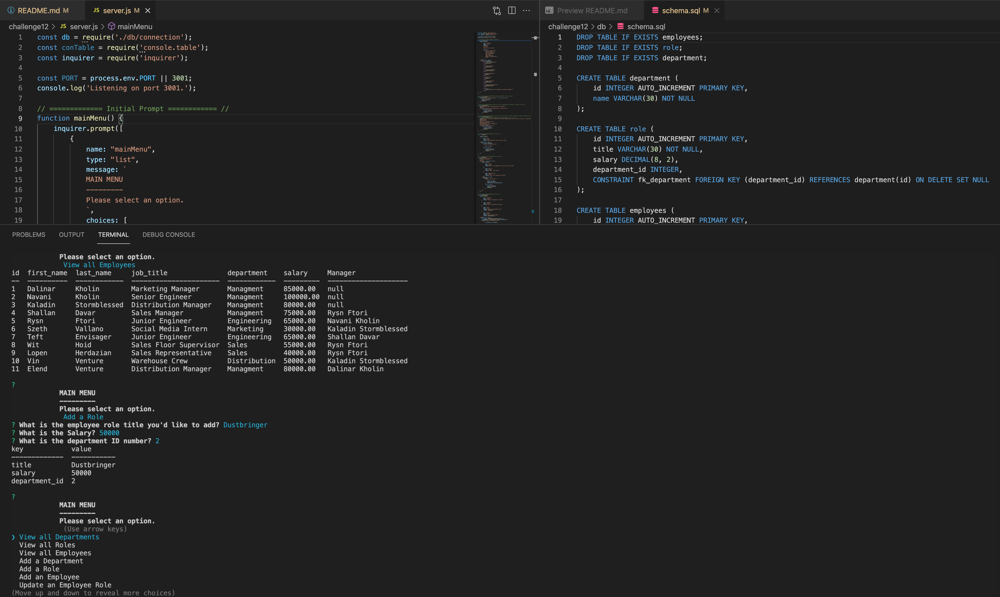

# UoT-coding-challenge-12

## Description: 
A command-line app to manage a company's employee database using Node.js, Inquirer, and MySQL.

Done as a challenge for UoT's Coding Bootcamp.
___

## Talbe of Contents
* [Installation](#installation)
* [Usage](#usage)
* [Links](#links)
* [Tools](#tools)
* [Credits](#credits)
* [License](#license)
* [Challenge Guidelines](#challenge-guidelines)
___

## Installation
Clone the repo to your local machine then open the terminal and run `npm install` to install the dependencies. Be sure to create your own .env file in the root directory with your mysql login credentials and include it in your .gitignore file.

Then login to your mysql and run `source db/db.sql` to set up the database and `source db/schema.sql` to define the tables. If you would like to use my mock entries, run `source db/seeds.sql. Use `quit` to exit out of mysql then in the terminal once again enter `npm start` to begin the application.
___

## Usage



___

## Links
### Walkthrough of app:
* [Video Walkthrough](https://drive.google.com/file/d/1E3egmrjHTY6ZrP9aIIMCWGwT6uU756Gg/view)
___

## Tools
* JavaScript
* node.js
* Inquirer 
* MySQL
* Console.table
* Dotenv

___

## Credits
* Completed by: [Nell-GitHub](https://github.com/ShannonNell)
___

## License
[](https://opensource.org/licenses/MIT)

[MIT License](https://choosealicense.com/licenses/mit/)    
___

## Challenge Guidelines
### User Story
```
AS A business owner
I WANT to be able to view and manage the departments, roles, and employees in my company
SO THAT I can organize and plan my business.
```
### Criteria: 
```
GIVEN a command-line application that accepts user input
WHEN I start the application
THEN I am presented with the following options: view all departments, view all roles, view all employees, add a department, add a role, add an employee, and update an employee role
WHEN I choose to view all departments
THEN I am presented with a formatted table showing department names and department ids
WHEN I choose to view all roles
THEN I am presented with the job title, role id, the department that role belongs to, and the salary for that role
WHEN I choose to view all employees
THEN I am presented with a formatted table showing employee data, including employee ids, first names, last names, job titles, departments, salaries, and managers that the employees report to
WHEN I choose to add a department
THEN I am prompted to enter the name of the department and that department is added to the database
WHEN I choose to add a role
THEN I am prompted to enter the name, salary, and department for the role and that role is added to the database
WHEN I choose to add an employee
THEN I am prompted to enter the employee’s first name, last name, role, and manager and that employee is added to the database
WHEN I choose to update an employee role
THEN I am prompted to select an employee to update and their new role and this information is updated in the database 
```